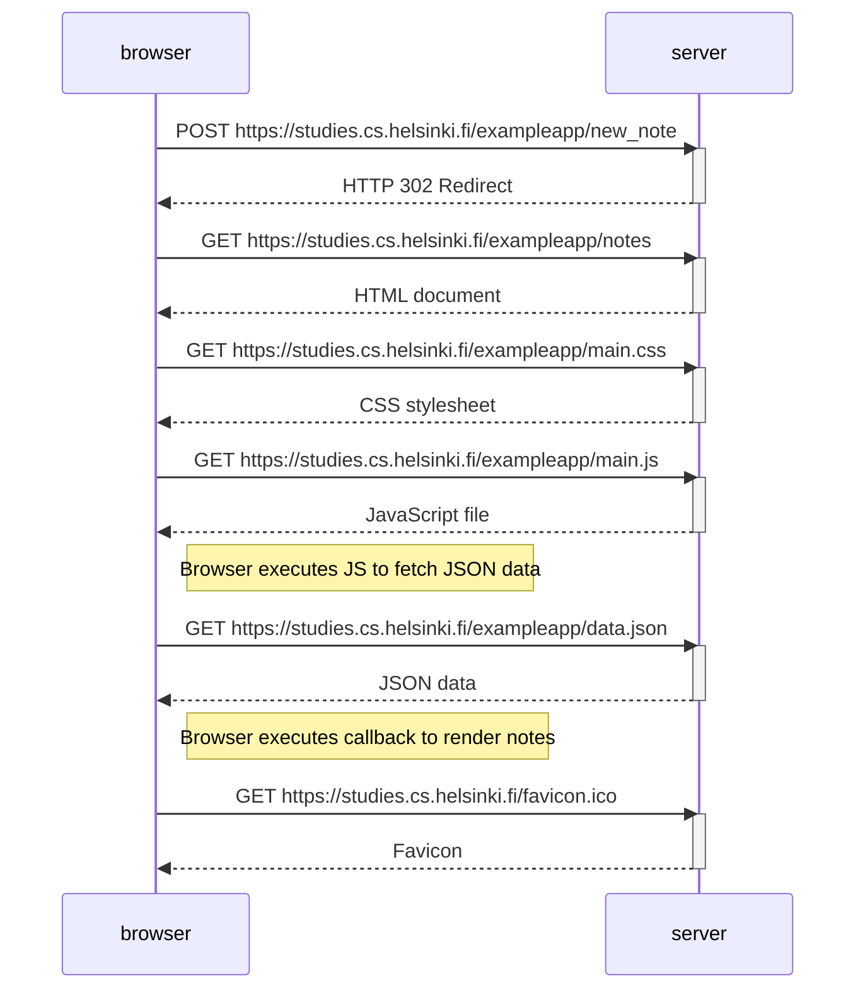

```mermaid
sequenceDiagram
    participant B as browser
    participant S as server

    B->>S: POST https://studies.cs.helsinki.fi/exampleapp/new_note
    activate S
    S-->>B: HTTP 302 Redirect
    deactivate S

    B->>S: GET https://studies.cs.helsinki.fi/exampleapp/notes
    activate S
    S-->>B: HTML document
    deactivate S

    B->>S: GET https://studies.cs.helsinki.fi/exampleapp/main.css
    activate S
    S-->>B: CSS stylesheet
    deactivate S

    B->>S: GET https://studies.cs.helsinki.fi/exampleapp/main.js
    activate S
    S-->>B: JavaScript file
    deactivate S

    Note right of B: Browser executes JS to fetch JSON data

    B->>S: GET https://studies.cs.helsinki.fi/exampleapp/data.json
    activate S
    S-->>B: JSON data
    deactivate S

    Note right of B: Browser executes callback to render notes

    B->>S: GET https://studies.cs.helsinki.fi/favicon.ico
    activate S
    S-->>B: Favicon
    deactivate S
```
