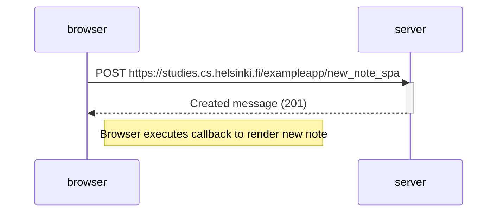

```mermaid
sequenceDiagram
    participant B as browser
    participant S as server

    B->>S: POST https://studies.cs.helsinki.fi/exampleapp/new_note_spa
    activate S
    S-->>B: Created message (201)
    deactivate S

    Note right of B: Browser executes callback to render new note
```
